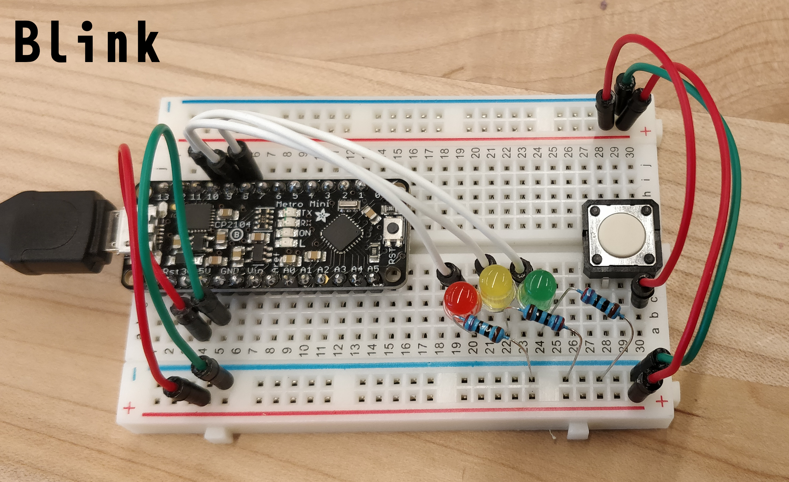

# IDD-Fa18-Lab1: Blink?

**A lab report by William J Leon**

> Include your responses to the bold questions on your own fork of the lab activities. Include snippets of code that explain what you did. Deliverables are due next Tuesday. Post your lab reports as `README.md` pages on your GitHub, and post a link to that on your main class hub page.

We've copied the questions from the lab here. Answer them below!

## Part A. Set Up a Breadboard

## Part B. Manually Blink a LED

**a. What color stripes are on a 100 Ohm resistor?**
Brown Black Brown
 
**b. What do you have to do to light your LED?**
 

## Part C. Blink a LED using Arduino

### 1. Blink the on-board LED

**a. What line(s) of code do you need to change to make the LED blink (like, at all)?**
'''14      #+BEGIN_SRC cpp                                                          
 15      void setup() {                                                           
 16        // put your setup code here, to run once:                              
 17        pinMode(1,OUTPUT);                                                     
 18      }                                                                        
 19                                                                               
 20      void loop() {                                                            
 21        // put your main code here, to run repeatedly:                         
 22        digitalWrite(1,HIGH);                                                  
 23        delay(300);                                                            
 24        digitalWrite(1,LOW);                                                   
 25        delay(300);                                                            
 26      }                                                                        
 27      #+END_SRC '''

**b. What line(s) of code do you need to change to change the rate of blinking?**

**c. What circuit element would you want to add to protect the board and external LED?**
 
**d. At what delay can you no longer *perceive* the LED blinking? How can you prove to yourself that it is, in fact, still blinking?**

**e. Modify the code to make your LED blink your way. Save your new blink code to your lab 1 repository, with a link on the README.md.**

### 2. Blink your LED

**Make a video of your LED blinking, and add it to your lab submission.**

[LEDs blinking in different ways](https://youtu.be/faF90KuzX0E)

## Part D. Manually fade an LED

**a. Are you able to get the LED to glow the whole turning range of the potentiometer? Why or why not?**

## Part E. Fade an LED using Arduino

**a. What do you have to modify to make the code control the circuit you've built on your breadboard?**

The LED needs to be moved to a PWM enabled pin and then change the code to use an analog signal for that PIN.

#+BEGIN_SRC cpp
void setup() {
  // put your setup code here, to run once:
}

void loop() {
  // put your main code here, to run repeatedly:
  for ( int i = 0; i < 256 ; i++ ) {
    analogWrite(9,i);
    delay(10);
  }
  for ( int i = 255; i > 0 ; i-- ) {
    analogWrite(9,i);
    delay(10);
  }
}
#+END_SRC

**b. What is analogWrite()? How is that different than digitalWrite()?**

digitalWrite() operates on TTL 5V logic

## Part F. FRANKENLIGHT!!!

### 1. Take apart your electronic device, and draw a schematic of what is inside. 

**a. Is there computation in your device? Where is it? What do you think is happening inside the "computer?"**

Yes, there is a battery charge controller IC

**b. Are there sensors on your device? How do they work? How is the sensed information conveyed to other portions of the device?**

There are internal sensors for the amount of potential in the battery to determine the state of charging.

**c. How is the device powered? Is there any transformation or regulation of the power? How is that done? What voltages are used throughout the system?**

The device is powered by mains (120 V, 60 Hz AC), there is a transformer and rectifier that drops the power to 5 V DC

**d. Is information stored in your device? Where? How?**

No information is stored on the device.

### 2. Using your schematic, figure out where a good point would be to hijack your device and implant an LED.

It is easiest to impant a light on the 5 V rails directly, or otherwise on the existing LED rails

**Describe what you did here.**

### 3. Build your light!

**Make a video showing off your Frankenlight.**

[LEDs blinking in different ways, includes lazy LED highjacking](https://youtu.be/faF90KuzX0E)

**Include any schematics or photos in your lab write-up.**
